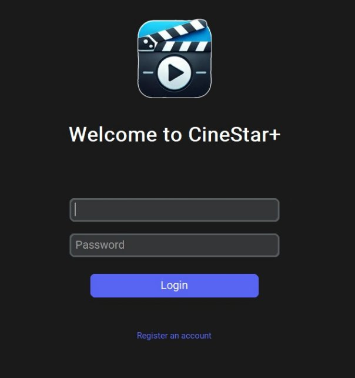
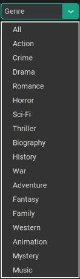
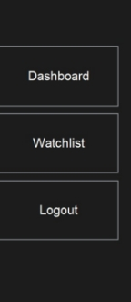
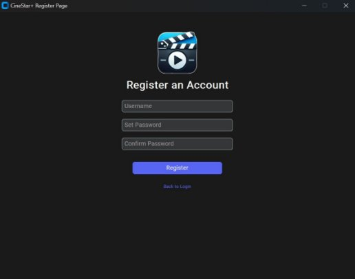


**Commands to Start the Application:**

Double-click on the “main.py” file to open it with the Python 		application. 

**Operating Systems that are Supported:**

Windows 11

**List of prerequisites softwares/libraries:**

Softwares(Python):

`	`Python:

- Visit the website:
- <https://www.python.org/downloads/release/python-3131/>
- Download the specific Python installer from the link provided. [Windows installer (64-bit)](https://www.python.org/ftp/python/3.13.1/python-3.13.1-amd64.exe)
- During the installation process, select the option to add Python to the system’s PATH environment variable.		

`	`Libraries:

- Open Command Prompt (CMD) as an administrator.
- Execute the following code:
- pip install pandas customtkinter Pillow mplcursors
- pandas (Python Library) - Data Analysis and Manipulation
- customtkinter (Python Library) - GUI Development
- Pillow (Python Library) - Image Processing
- mplcursors - Interactive Data Cursors for Matplotlib

**List of libraries/APIs/Databases used:**
**
`	`Libraries:

- customtkinter
- tkinter(messagebox)
- pandas
- PIL(Image,ImageTk)
- requests
- io
- os
- cdv
- mplcursors
- sqlite3
- json
- atexit
- numpy

`	`API:

- Omdb (API key:5d8c34f2)

**Brief Description of all Features Implemented(Screenshots):**

**Brief description of the classes and modules made:**

Modules:

- csv:

A Python standard library module for reading from and writing to CSV (Comma-Separated Values) files. It provides functionality for parsing CSV data into Python's native data structures and converting them back into CSV format, making it easy to handle tabular data.

- numpy:

The numpy library in Python is a powerful package primarily used for numerical computing, offering efficient and versatile tools for working with arrays, matrices, and high-level mathematical functions. It's widely used in data analysis, scientific computing, machine learning, and other fields where handling large datasets or performing complex numerical computations is required.

- mplcursors:

A Python library that provides interactive data cursors for Matplotlib plots. It allows users to easily create clickable and customizable data points on a plot, enabling the display of information such as data values or coordinates when hovering or clicking on elements within a figure.

- os:

A Python standard library module for interacting with the operating system. It allows for file and directory operations like path manipulation, creating and deleting files, and executing system commands, enabling seamless interaction with the file system.

- io:

A built-in Python module that provides the infrastructure for working with streams and in-memory binary data. It is commonly used for handling byte data in operations like reading from or writing to files and network streams.

- sqlite3:

A module that allows Python programs to interact with SQLite databases. It is used for managing user data and authenticating login credentials in the app

- PIL:

Part of the Pillow library for handling image files and converting them to formats suitable for display in a tkinterapplication.

- atexit:

The atexit module in Python is a utility to register cleanup functions that are executed when the program terminates, regardless of how the termination occurs (normal exit, reaching the end of the program, or calling sys.exit()). These functions help perform final actions, such as saving data, releasing resources, or logging important information, ensuring your application exits cleanly.

- json:

The json module in Python is used to work with JSON (JavaScript Object Notation) data, a lightweight data interchange format. This module enables converting Python objects (like dictionaries, lists) to JSON strings and vice versa.

- pandas:

A powerful data manipulation library used for reading, processing, and handling movie data stored in CSV files.

- tkinter.messagebox:

A built-in module for displaying message boxes that provide feedback and alerts to the user.

- customtkinter:

A customized version of tkinter that provides modern and flexible UI elements, enabling the creation of an attractive application interface.

Classes:

- MovieSearchApp:

The primary objective of this class is to construct the home page window of our application. It includes multiple methods and attributes, such as load\_movies and search\_button. Upon initialization, it sets up the window's title, screen width, screen height, and geometry, and loads movie data from a database accessible to authenticated users. Additionally, it creates widgets and buttons for essential functionalities, including the Dashboard, Watchlist, Login/Register, and Logout.

The class also features code for sorting movies based on genres and release years. It downloads and stores movie posters locally to enhance performance during subsequent accesses. Various movie details—such as rating, director, cast, crew, title, and release year—are presented in a separate window. Within this window, different buttons like 'Rate Movie' and 'Save to Watchlist' are created to enable user interaction.

The Watchlist is updated dynamically as users add or remove movies, and the rating button opens a separate window that allows users to rate a movie. When the Watchlist option on the home page is clicked, a new window displays all saved movies, with options for users to remove movies from the list.Even the movie section features a discussion column where any user can share their opinions about each movie. Additionally, it displays the user’s saved movies in a bar graph format.

- Movie:

The Movie class is designed to store and manage various attributes of a movie, such as its title, release year, genre, IMDb rating, director, and cast, while also tracking the movie's rating history. It includes methods like add\_rating(rating, date), which adds a new rating entry to the rating\_history, and get\_rating\_trend(), which returns the movie's rating trend as a list of date-rating tuples. The update\_rating(new\_rating) method allows the IMDb rating to be updated, and is\_top\_rated(threshold=8.0) determines if the movie's rating meets or exceeds a given threshold to be considered top-rated. The class also features a \_\_repr\_\_() method for a string representation of the movie's details. The Movie class helps manage and display movie information effectively, enabling users to analyze rating trends, update ratings, and check for top-rated status, making it a valuable structure for building movie-related applications.

- MovieCollection:

The MovieCollection class serves as a manager for a list of Movie objects, providing various functionalities to handle and analyze the collection. It allows users to add movies, remove them by title, and update their ratings. The class includes methods to filter movies by genre or release year and retrieve top-rated movies based on a specified rating threshold. It also enables the generation of summary reports, such as average ratings per genre, and supports saving the collection to a CSV file for external use. By integrating these features, the MovieCollection class facilitates efficient management, analysis, and visualization of a movie library, ensuring flexibility and convenience in handling movie-related data.

- BasePage:

This class serves as a base for creating pages within the application. It initializes shared elements such as the app logo and sets general properties for pages, like window size and title. It also contains the add\_logo() method to add the logo to the page.

- LoginPage:

Represents the login screen of the app. It includes entry fields for username and password, and buttons for logging in and registering a new account. The login\_action() method validates user credentials and opens the MovieSearchApp if successful. The register\_action() method navigates to the RegisterPage for user registration.

- RegisterPage:

Represents the registration screen for new users. It includes input fields for the username, password, and password confirmation, as well as buttons to submit registration details or navigate back to the login page. The register\_action()method validates the input and creates a new user account if the data is correct, while the back\_to\_login() method closes the registration page and opens the login page.

- LoginRegisterWindow:

The LoginRegisterWindow class is a secondary window that inherits from ctk.CTkToplevel and serves as the user interface for user authentication, allowing users to either log in or register for an account. This class is designed with a dark-themed interface and includes entry fields for the username and password, along with Login and Register buttons. Upon initialization, it sets up the window with specified dimensions and a dark background color. The create\_widgetsmethod organizes the layout by creating labels and entry widgets for username and password inputs, and buttons for login and registration actions.The login method verifies user credentials against a dictionary (users) in the parent MovieSearchApp instance. If the credentials match, the current user's session is established, and a success message is displayed before the window is closed. If the credentials are invalid, an error message is shown. The register method checks if the provided username already exists; if not, it adds the new user to the users dictionary and shows a success message. If the username is already taken, an error message is displayed. This class supports basic user management and ensures a secure method of user authentication within the movie search application.

- LoginRegisterWindow:

The Visualizer class is designed to create and display a bar chart that compares the average ratings of different movie genres using data from a CSV file. The class includes a static method plot\_genre\_comparison() that reads the movie data, processes the genre and rating information, and calculates the average rating for each genre. It then visualizes the data with a bar chart using Matplotlib. The plot is enhanced with interactive hover functionality provided by mplcursors, allowing users to view the genre name and its corresponding average rating when hovering over each bar. This method makes it easier to analyze movie ratings by genre and provides an engaging user experience with real-time data interaction.

**Brief description of work done by each team member**:

GUI:

Main Page - Abhinav, Munjikesh

Watchlist - Munjikesh, Heer

Login/Register - Prashant

Info Page - Abhinav

Integrating - Dev

Search Bar - Abhinav

Sorting - Abhinav

Data:

Scraping - Heer

Storing and Retrieving - Dev, Munjikesh

Management - Prashant

Files:

login.py - Prashant

main.py - Munjikesh

maingui2.py - Munjikesh, Dev, Abhinav, Heer, Prashant

movie.py - Heer

movie\_collection.py - Heer

movie\_dashboard.py - Dev

resource.py - Dev

moviedata.csv - Heer

1000\_movies.csv- Heer

